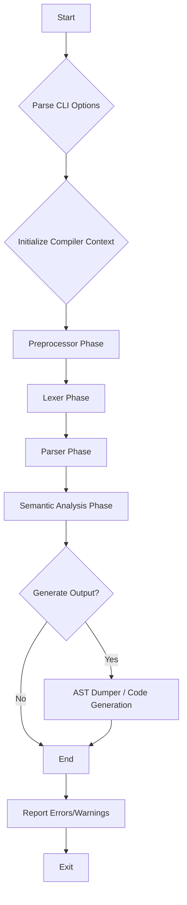

# Cendol - C11 Compiler Driver Design Document

## Table of Contents
1. [Overview](#overview)
2. [Purpose and Responsibilities](#purpose-and-responsibilities)
3. [CLI Options (using `clap`)](#cli-options-using-clap)
4. [Compiler Lifecycle Management](#compiler-lifecycle-management)
5. [Error Handling and Reporting](#error-handling-and-reporting)
6. [Configuration Management](#configuration-management)
7. [Integration with Compiler Phases](#integration-with-compiler-phases)
8. [Future Considerations](#future-considerations)

## Overview

This document outlines the design for the Cendol C11 Compiler Driver, a crucial component responsible for orchestrating the various phases of the Cendol C11 compiler. Written in Rust, the driver will provide a command-line interface for users to interact with the compiler, manage the compilation lifecycle, and handle overall configuration and error reporting.

## Purpose and Responsibilities

The primary purpose of the compiler driver is to manage the end-to-end compilation process. Its key responsibilities include:
- **CLI Option Parsing**: Interpreting user-provided command-line arguments to configure the compilation process.
- **Compiler Phase Orchestration**: Managing the execution flow of the preprocessor, lexer, parser, semantic analyzer, and other future phases.
- **Configuration Management**: Passing relevant configurations and options to each compiler phase.
- **Error Aggregation and Reporting**: Collecting errors and warnings from all phases and presenting them to the user in a coherent manner.
- **Input/Output Management**: Handling source file input and directing output (e.g., AST dumps, compiled artifacts).
- **Lifecycle Management**: Ensuring proper setup and teardown of compiler resources.

## CLI Options (using `clap`)

The compiler driver will utilize the `clap` crate for robust and user-friendly command-line argument parsing. Below is a preliminary design for the CLI options:

```rust
#[derive(Parser, Debug)]
#[clap(author, version, about = "Cendol - C11 Compiler Driver", long_about = None)]
struct Cli {
    /// Input C source file(s)
    #[clap(value_parser)]
    input_files: Vec<PathBuf>,

    /// Output file path
    #[clap(short, long, value_parser, value_name = "FILE")]
    output: Option<PathBuf>,

    /// Enable verbose output
    #[clap(short, long)]
    verbose: bool,

    /// Dump AST to a specified format (e.g., "json", "dot", "human")
    #[clap(long, value_parser, value_name = "FORMAT")]
    dump_ast: Option<String>,

    /// Preprocessor options
    #[clap(flatten)]
    preprocessor_opts: PreprocessorOptions,

    /// Lexer options
    #[clap(flatten)]
    lexer_opts: LexerOptions,

    /// Parser options
    #[clap(flatten)]
    parser_opts: ParserOptions,

    /// Semantic analysis options
    #[clap(flatten)]
    semantic_opts: SemanticOptions,

    /// Target architecture (e.g., "x86_64", "arm64")
    #[clap(long, value_parser, default_value = "x86_64")]
    target: String,

    /// Optimization level (0-3)
    #[clap(short = 'O', long, value_parser = clap::value_parser!(u8).range(0..=3), default_value = "0")]
    optimize: u8,

    /// Emit assembly code
    #[clap(long)]
    emit_asm: bool,

    /// Emit LLVM IR
    #[clap(long)]
    emit_llvm: bool,
}

#[derive(Args, Debug)]
struct PreprocessorOptions {
    /// Define a macro
    #[clap(short = 'D', long = "define", value_parser, value_name = "NAME[=VALUE]", action = clap::ArgAction::Append)]
    defines: Vec<String>,

    /// Add directory to include search path
    #[clap(short = 'I', long = "include-path", value_parser, value_name = "DIR", action = clap::ArgAction::Append)]
    include_paths: Vec<PathBuf>,
}

#[derive(Args, Debug)]
struct LexerOptions {
    /// Enable lexer debugging output
    #[clap(long)]
    debug_lexer: bool,
}

#[derive(Args, Debug)]
struct ParserOptions {
    /// Enable parser debugging output
    #[clap(long)]
    debug_parser: bool,
}

#[derive(Args, Debug)]
struct SemanticOptions {
    /// Enable semantic analysis debugging output
    #[clap(long)]
    debug_semantic: bool,
}
```

## Compiler Lifecycle Management

The driver will manage the compiler's lifecycle through a series of sequential phases. The general flow will be:



Each phase will be executed, and its output will serve as the input for the subsequent phase. The driver will be responsible for passing the necessary data structures and configurations between these phases.

## Error Handling and Reporting

The compiler driver will centralize error handling and reporting.
- It will collect `CompilerError` instances from each phase.
- Errors and warnings will be stored in a central `Diagnostics` struct.
- The driver will format and print these diagnostics to the console, potentially using different verbosity levels based on CLI options.
- The `ErrorFormatter` (as defined in `main.md`) will be used to provide rich, colored error messages with code snippets.

## Configuration Management

The `Cli` struct parsed by `clap` will serve as the primary configuration source.
- The driver will create a `CompilerConfig` struct from the parsed `Cli` options.
- This `CompilerConfig` will then be passed down to individual compiler phases (Preprocessor, Lexer, Parser, Semantic Analyzer) as needed.
- Each phase will have its own specific configuration struct (e.g., `PreprocessorConfig`, `LexerConfig`) derived from the main `CompilerConfig`.

## Integration with Compiler Phases

The driver will integrate with existing compiler phases by:
- Instantiating each phase (e.g., `Preprocessor`, `Lexer`, `Parser`, `SemanticAnalyzer`).
- Calling their respective `run` or `process` methods, passing the input from the previous phase and the relevant configuration.
- Collecting any errors or warnings returned by each phase.

Example integration (conceptual):

```rust
fn main() -> Result<(), Box<dyn Error>> {
    let cli = Cli::parse();
    let config = CompilerConfig::from_cli(&cli);
    let mut diagnostics = Diagnostics::new();

    // 1. Preprocessor Phase
    let preprocessed_source = Preprocessor::new(&config.preprocessor_config)
        .run(&cli.input_files[0], &mut diagnostics)?;

    // 2. Lexer Phase
    let token_stream = Lexer::new(&config.lexer_config)
        .run(&preprocessed_source, &mut diagnostics)?;

    // 3. Parser Phase
    let parse_result = Parser::new(&config.parser_config)
        .run(&token_stream, &mut diagnostics)?;

    // 4. Semantic Analysis Phase
    let semantic_result = SemanticAnalyzer::new(&config.semantic_config)
        .run(&parse_result.ast, &parse_result.symbol_table, &mut diagnostics)?;

    // 5. Output Generation (e.g., AST Dumper)
    if let Some(format) = &cli.dump_ast {
        let dumper_config = DumpConfig {
            format: OutputFormat::from_str(format)?,
            include_symbols: true,
            include_types: true,
            include_locations: true,
            max_depth: None,
            highlight_errors: false,
        };
        let dumper = HumanReadableDumper::new(); // Or JsonDumper, DotDumper
        let dumped_ast = dumper.dump_node(semantic_result.annotated_ast.unwrap(), &dumper_config);
        println!("{}", dumped_ast);
    }

    // Report all collected diagnostics
    diagnostics.report_all();

    if diagnostics.has_errors() {
        Err("Compilation failed with errors.".into())
    } else {
        Ok(())
    }
}
```

## Future Considerations

- **Multiple Input Files**: Support compiling multiple C source files and linking them.
- **Linker Integration**: Integrate with a linker to produce executable binaries.
- **Intermediate Representation (IR) Generation**: Add phases for generating LLVM IR or other intermediate representations.
- **Optimization Passes**: Implement various optimization passes on the IR.
- **Target-Specific Code Generation**: Support different target architectures and operating systems.
- **Build System Integration**: Provide options for integration with build systems like Make or Cargo.
- **Incremental Compilation**: Explore techniques for faster recompilation of changed files.