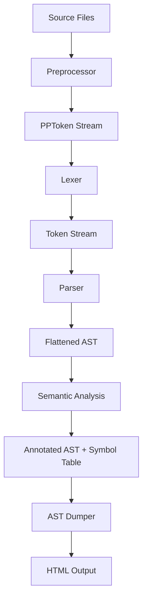

# Data Flow and Integration Design Document

## Compiler Pipeline Overview

The Cendol compiler follows a traditional multi-phase architecture with clear data flow between phases. Each phase processes input from the previous phase and produces structured output for the next phase.



## Phase Inputs and Outputs

### Preprocessor Phase
**Input:**
- Source files and include paths
- Compiler configuration (macros, feature flags)

**Output:**
- `PPToken` stream with preprocessing directives resolved
- Source location mappings preserved
- Built-in macros initialized

### Lexer Phase
**Input:**
- `PPToken` stream from preprocessor
- Source manager for location tracking

**Output:**
- `Token` stream with keywords pre-interned
- Symbol table with global symbol interning
- Source spans for error reporting

### Parser Phase
**Input:**
- `Token` stream from lexer
- Diagnostic engine for error reporting

**Output:**
- Flattened AST (`Ast` struct with contiguous node storage)
- Initial symbol table with declarations
- Parse errors and warnings

### Semantic Analysis Phase
**Input:**
- Flattened AST from parser
- Symbol table from parser
- Type system definitions

**Output:**
- Annotated AST with resolved types and symbols
- Complete symbol table with all bindings
- Type table with canonicalized types
- Semantic errors and warnings

### AST Dumper Phase
**Input:**
- Annotated AST and symbol table
- Source manager for code snippets
- Dump configuration

**Output:**
- Interactive HTML visualization
- Cross-referenced tables (symbols, types, scopes)
- Source code integration

## Key Data Structures

```rust
/// Global symbol interning (from symbol_table crate)
pub type Symbol = symbol_table::GlobalSymbol;

/// Source location tracking (imported from source_manager)
pub use crate::source_manager::{SourceId, SourceLoc, SourceSpan};

/// Flattened AST storage
pub struct Ast {
    pub nodes: Vec<Node>,
    pub types: Vec<Type>,
    pub symbol_entries: Vec<SymbolEntry>,
    pub initializers: Vec<Initializer>,
}

/// Token structures
pub struct PPToken { /* Preprocessor tokens */ }
pub struct Token { /* Lexer tokens with pre-interned keywords */ }

/// Analysis results
pub struct SemanticOutput {
    pub errors: Vec<SemanticError>,
    pub warnings: Vec<SemanticWarning>,
}
```

## Memory Management Strategy

- **Direct File Reading**: Files read as raw bytes (`std::fs::read`) assuming UTF-8 validity
- **Unsafe UTF-8 Conversion**: `String::from_utf8_unchecked()` and `str::from_utf8_unchecked()` for performance
- **Flattened Storage**: All AST data in contiguous vectors for spatial locality
- **Index-based References**: `NodeRef`, `TypeRef`, `SymbolEntryRef` for efficient access
- **Panic on Invalid SourceId**: SourceManager methods panic on invalid IDs for performance

## Error Propagation

Each phase can produce errors that are collected and reported:

1. **Preprocessor**: Include errors, macro definition issues
2. **Lexer**: Invalid tokens, encoding problems
3. **Parser**: Syntax errors, missing tokens
4. **Semantic**: Type errors, undefined symbols, scope violations
5. **Dumper**: Output generation issues

Errors include source locations for precise reporting and IDE integration.