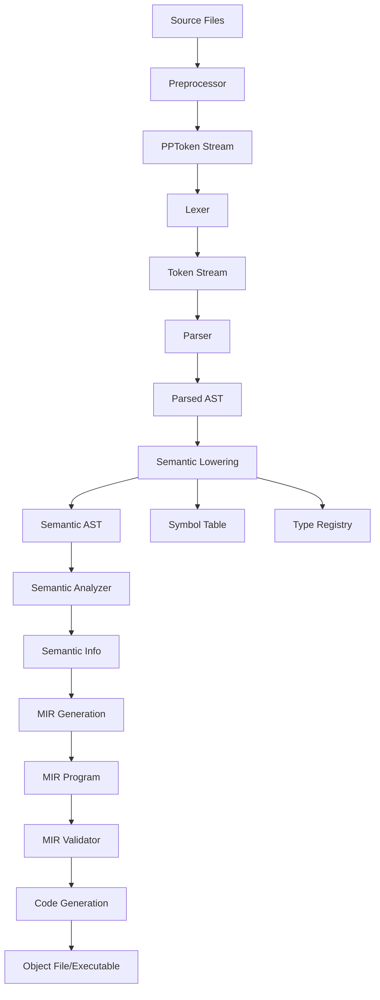

# Cendol - C11 Compiler Design Document

## Table of Contents
1. [Overview](#overview)
2. [Architecture Overview](#architecture-overview)
   2.1. [Compiler Driver Design](compiler_driver_design.md)
   2.2. [Rust Environment and External Crates](rust_environment_design.md)
3. [Preprocessor Phase](preprocessor_design.md)
4. [Lexer Phase](lexer_design.md)
5. [Parser Phase](parser_design.md)
6. [Abstract Syntax Tree (AST) Design](ast_design.md)
7. [Semantic Analysis Phase](semantic_analysis_design.md)
8. [MIR Generation](mir_design.md)
9. [Code Generation](codegen_design.md)
10. [AST Dumper Phase](ast_dumper_design.md)
11. [Data Flow and Integration](data_flow_design.md)
12. [Performance Considerations](performance_design.md)
13. [Error Handling Strategy](error_handling_design.md)

## Overview

This document outlines the design for Cendol, a high-performance C11 compiler written in Rust. The compiler follows a modern multi-phase architecture optimized for performance, cache efficiency, and comprehensive C11 standard compliance. The design features a flattened AST representation, a dedicated MIR (Middle Intermediate Representation) for semantic analysis and optimization, and Cranelift-based code generation.

### Design Goals
- **Performance**: Minimize memory allocations and maximize cache locality
- **Standards Compliance**: Full C11 support including all optional features
- **Modularity**: Clear separation of concerns between phases
- **Extensibility**: Easy to extend for future C standards and optimizations
- **Debuggability**: Comprehensive error reporting and debugging support

## Architecture Overview

### Key Design Decisions

1. **Flattened AST Storage**: All AST nodes in contiguous vectors for superior cache performance
2. **Global Symbol Interning**: Thread-safe symbol interning using `symbol_table` crate
3. **Packed Source Locations**: Efficient `SourceLoc` (4 bytes) and `SourceSpan` (8 bytes)
4. **Index-based References**: `NodeRef`, `TypeRef`, `SymbolRef` for fast access
5. **Bit Flags**: Compact boolean storage using `bitflags` crate for flags
6. **Rich Diagnostics**: IDE-quality error reporting with `annotate_snippets`
7. **MIR-based Design**: Dedicated Mid-level Intermediate Representation for semantic analysis and optimization
8. **Cranelift Integration**: Efficient code generation through Cranelift backend

## Compiler Pipeline Phases

### 1. Preprocessor Phase
Transforms C source code by handling macro expansion, conditional compilation, and file inclusion. Produces a stream of preprocessing tokens (`PPToken`).

**Key Features:**
- Modular architecture with separate lexer (`pp_lexer.rs`), expression parser (`expr_parser.rs`), and main preprocessor (`preprocessor.rs`)
- Full macro expansion including token pasting and stringification
- Include file resolution with header search paths and include guard detection
- Conditional compilation (`#if`, `#ifdef`, `#ifndef`, etc.)

### 2. Lexer Phase
Converts the `PPToken` stream into a lexical `Token` stream.

**Key Features:**
- Buffers preprocessor output for efficient token consumption
- Identifies C keywords and interned identifiers
- Handles numeric and string literals according to C11 rules

### 3. Parser Phase
Constructs a `ParsedAst` from the token stream using Pratt parsing for expressions and recursive descent for statements/declarations.

**Key Features:**
- Produces a preliminary "flattened" AST representation (`ParsedAst`)
- Pratt parser for efficient expression parsing with C11 precedence
- Sophisticated disambiguation for C declarations and type names
- Error recovery with synchronization points

### 4. Semantic Lowering Phase
Transforms `ParsedAst` into a semantic `Ast`, populates the `SymbolTable` and `TypeRegistry`, and constructs scopes.

**Key Features:**
- Declaration lowering (mapping C declarations to symbols)
- Scope construction and name resolution
- Initial type resolution and registry population
- Transformation of parser-specific nodes into semantic-ready nodes

### 5. Semantic Analysis Phase
Performs type checking and validation on the semantic `Ast`, producing a `SemanticInfo` side table.

**Key Features:**
- Comprehensive type checking and compatibility validation
- Expression type resolution (attaching types to all expressions)
- Implicit conversion analysis (integer promotion, usual arithmetic conversions)
- LValue/RValue and modifiability checks
- Constant expression evaluation

### 6. MIR Generation Phase
Transforms the analyzed `Ast` (and its `SemanticInfo`) into a typed, explicit Mid-level Intermediate Representation (MIR).

**Key Features:**
- Typed MIR with explicit control flow and basic blocks
- Lowering of C constructs to simple MIR operations
- Explicit memory operations and type conversions
- Preservation of type information for downstream optimization

### 7. MIR Validation Phase
Ensures the correctness of the generated MIR before passing it to the code generator.

**Key Features:**
- Type consistency checks
- Control flow graph validation
- Invariant verification for MIR operations

### 8. Code Generation Phase
Generates target machine code using the Cranelift backend and handles linking.

**Key Features:**
- Cranelift-based code generation from MIR
- Support for emitting Cranelift IR, object files, or executables
- Integration with system linker (`LinkGen`) for final artifact creation

## Supporting Infrastructure

### Error Handling
- Rich diagnostic system with `annotate_snippets` for beautiful error messages
- Phase-specific error recovery strategies with synchronization points
- IDE integration with structured error output
- Non-blocking compilation that continues despite errors
- Detailed source location tracking with `SourceSpan`

### Data Flow
- Clear interfaces between all compiler phases using dedicated data structures
- Efficient memory management with arena-style allocation patterns
- Global symbol interning for fast identifier comparison across phases
- Packed data structures for optimal cache usage and memory efficiency
- Semantic information side tables for post-analysis data

### Performance Optimizations
- Flattened data structures for cache-friendly access patterns
- Index-based references instead of pointers to reduce indirection
- Bit flags for compact boolean storage using `bitflags` crate
- Streaming processing to minimize memory pressure
- Pre-interned symbols and keywords for fast lookups
- MIR validation to catch errors early in the pipeline