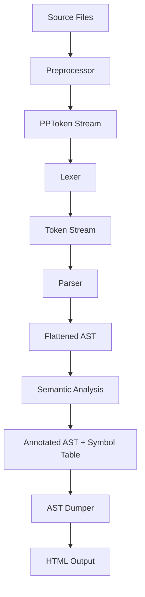

# Cendol - C11 Compiler Design Document

## Table of Contents
1. [Overview](#overview)
2. [Architecture Overview](#architecture-overview)
    2.1. [Compiler Driver Design](compiler_driver_design.md)
    2.2. [Rust Environment and External Crates](rust_environment_design.md)
3. [Preprocessor Phase](preprocessor_design.md)
4. [Lexer Phase](lexer_design.md)
5. [Parser Phase](parser_design.md)
6. [Abstract Syntax Tree (AST) Design](ast_design.md)
7. [Semantic Analysis Phase](semantic_analysis_design.md)
8. [AST Dumper Phase](ast_dumper_design.md)
9. [Data Flow and Integration](data_flow_design.md)
10. [Performance Considerations](performance_design.md)
11. [Error Handling Strategy](error_handling_design.md)

## Overview

This document outlines the design for Cendol, a high-performance C11 compiler written in Rust. The compiler follows a traditional multi-phase architecture optimized for performance, cache efficiency, and comprehensive C11 standard compliance, with a future focus on using Cranelift for code generation.

### Design Goals
- **Performance**: Minimize memory allocations and maximize cache locality
- **Standards Compliance**: Full C11 support including all optional features
- **Modularity**: Clear separation of concerns between phases
- **Extensibility**: Easy to extend for future C standards and optimizations
- **Debuggability**: Comprehensive error reporting and debugging support

## Architecture Overview

```mermaid
graph TD
    Source[Source Files] --> Preprocessor
    Preprocessor --> PPTokenStream[PPToken Stream]
    PPTokenStream --> Lexer
    Lexer --> TokenStream[Token Stream]
    TokenStream --> Parser
    Parser --> FlattenedAST[Flattened AST]
    FlattenedAST --> SemanticAnalyzer[Semantic Analysis]
    SemanticAnalyzer --> AnnotatedAST[Annotated AST + Symbol Table]
    AnnotatedAST --> ASTDumper[AST Dumper]
    ASTDumper --> HTML[HTML Output]
```

### Key Design Decisions

1. **Flattened AST Storage**: All AST nodes in contiguous vectors for superior cache performance
2. **Global Symbol Interning**: Thread-safe symbol interning using `symbol_table` crate
3. **Packed Source Locations**: Efficient `SourceLoc` (4 bytes) and `SourceSpan` (8 bytes)
4. **Index-based References**: `NodeRef`, `TypeRef`, `SymbolEntryRef` for fast access
5. **Bit Flags**: Compact boolean storage using `bitflags` crate for flags
6. **Rich Diagnostics**: IDE-quality error reporting with `annotate_snippets`

## Compiler Pipeline Phases

### 1. Preprocessor Phase
Transforms C source code by handling macro expansion, conditional compilation, and file inclusion. Produces a stream of preprocessing tokens (`PPToken`) that represent the preprocessed source.

**Key Features:**
- Clang-inspired modular architecture with separate components
- Macro expansion with argument rescanning and token pasting
- Include file resolution with guard detection
- Packed bit flags for macro properties

### 2. Lexer Phase
Tokenizes the preprocessing token stream into lexical tokens with pre-interned keywords. Converts `PPToken` stream to `Token` stream ready for parsing.

**Key Features:**
- UTF-8 only support with efficient character handling
- Global symbol interning for identifiers
- Packed token flags for lexical properties
- Memory prefetching hints for performance

### 3. Parser Phase
Constructs a flattened Abstract Syntax Tree from the token stream using Pratt parsing for expressions and recursive descent for statements.

**Key Features:**
- Flattened AST storage in contiguous vectors
- Pratt parser with full C11 operator precedence
- Index-based node references for cache efficiency
- Complex declarator parsing for C's type system

### 4. Semantic Analysis Phase
Performs comprehensive analysis of the AST to ensure semantic correctness, building symbol tables and resolving types.

**Key Features:**
- Multi-pass analysis (collection, resolution, validation, annotation)
- Hierarchical scope management with efficient lookups
- Type canonicalization and compatibility checking
- Label resolution and control flow validation

### 5. AST Dumper Phase
Generates interactive HTML visualization of the compiler's internal state for debugging and analysis.

**Key Features:**
- Cross-referenced tables (AST nodes, symbols, types, scopes)
- Interactive HTML with collapsible trees and search
- Source code integration with syntax highlighting
- Comprehensive debugging information

## Supporting Infrastructure

### Error Handling
- Rich diagnostic system with `annotate_snippets` for beautiful error messages
- Phase-specific error recovery strategies
- IDE integration with structured error output
- Non-blocking compilation that continues despite errors

### Data Flow
- Clear interfaces between all compiler phases
- Efficient memory management with arena allocation
- Global symbol interning for fast identifier comparison
- Packed data structures for optimal cache usage

### Performance Optimizations
- Flattened data structures for cache-friendly access
- Index-based references instead of pointers
- Bit flags for compact boolean storage
- Streaming processing to minimize memory pressure