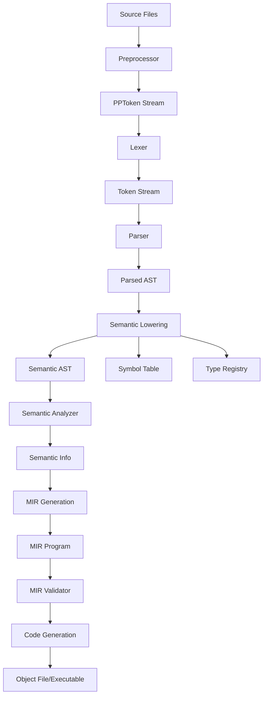

# Cendol - C23 Compiler Design Document

## Table of Contents
1. [Overview](#overview)
2. [Architecture Overview](#architecture-overview)
   2.1. [Compiler Driver Design](compiler_driver_design.md)
   2.2. [Rust Environment and External Crates](rust_environment_design.md)
3. [Preprocessor Phase](preprocessor_design.md)
4. [Lexer Phase](lexer_design.md)
5. [Parser Phase](parser_design.md)
6. [Abstract Syntax Tree (AST) Design](ast_design.md)
7. [Semantic Analysis Phase](semantic_analysis_design.md)
8. [MIR Generation](mir_design.md)
9. [Code Generation](codegen_design.md)
10. [Data Flow and Integration](data_flow_design.md)
11. [Performance Considerations](performance_design.md)
12. [Error Handling Strategy](error_handling_design.md)

## Overview

This document outlines the design for Cendol, a high-performance C23 compiler written in Rust. The compiler follows a modern multi-phase architecture optimized for performance, cache efficiency, and comprehensive C23 standard compliance. The design features a flattened AST representation, a dedicated MIR (Middle Intermediate Representation) for semantic analysis and optimization, and Cranelift-based code generation.

### Design Goals
- **Performance**: Minimize memory allocations and maximize cache locality using flattened data structures.
- **Standards Compliance**: Comprehensive C23 support including new literal types, digit separators, and enhanced preprocessor features.
- **Modularity**: Clear separation between purely syntactic (`ParsedAst`) and semantically resolved (`Ast`) representation.
- **Extensibility**: Backend-agnostic design with a typed MIR that serves as the bridge to native code generation.

## Architecture Overview

```mermaid
graph TD
    Source[Source Files] --> Preprocessor
    Preprocessor --> PPTokenStream[PPToken Stream]
    PPTokenStream --> Lexer
    Lexer --> TokenStream[Token Stream]
    TokenStream --> Parser
    Parser --> ParsedAST[Parsed AST]
    ParsedAST --> SemanticLowering[Semantic Lowering]
    SemanticLowering --> Ast[Semantic AST]
    SemanticLowering --> SymbolTable[Symbol Table]
    SemanticLowering --> TypeRegistry[Type Registry]
    Ast --> SemanticAnalyzer[Semantic Analyzer]
    SemanticAnalyzer --> SemanticInfo[Semantic Info]
    SemanticInfo --> MIRGen[MIR Generation]
    MIRGen --> MIR[MIR Program]
    MIR --> MIRValidator[MIR Validator]
    MIRValidator --> CodeGen[Code Generation]
    CodeGen --> ObjectFile[Object File/Executable]
```

### Key Design Decisions

1. **Flattened AST Storage**: Contiguous vectors for nodes, reducing pointer indirection and improving cache locality.
2. **Two-Stage AST**: A clear boundary between the parser's syntactic output and the analyzer's semantic output.
3. **Index-based References**: `NodeRef`, `TypeRef`, and `SymbolRef` are compact indices rather than heap pointers.
4. **Side Table Metadata**: Semantic information (types, value categories) is stored in parallel vectors indexed by `NodeRef`.
5. **MIR-based Backend**: A typed Mid-level IR that abstracts away C-specific details for the code generator.
6. **Rich Diagnostics**: IDE-quality error reporting with full source context and multiple errors per pass.

## Compiler Pipeline Phases

### 1. Preprocessor Phase
Transforms C source code by handling macro expansion, conditional compilation, and file inclusion. Produces a stream of preprocessing tokens (`PPToken`). Supports C23 features like `#elifdef`, `#elifndef`, and `__has_c_attribute`.

### 2. Lexer Phase
Converts the `PPToken` stream into a lexical `Token` stream. Recognizes C23 binary literals, digit separators, and new keywords like `nullptr`, `constexpr`, and `static_assert`.

### 3. Parser Phase
Constructs a `ParsedAst` using Pratt parsing for expressions and recursive descent for statements. Handles the syntactic structure of declarations without resolving symbols or types.

### 4. Semantic Lowering Phase
Transforms the purely syntactic `ParsedAst` into a semantic `Ast`. This phase resolves identifiers to symbols, computes types for declarations (pointers, arrays, functions), and manages hierarchical scopes.

### 5. Semantic Analysis Phase
Performs type checking and validation on the `Ast`. It computes types for all expression nodes, resolves implicit conversions (decay, promotion), and validates C23 semantic constraints. Results are stored in the `SemanticInfo` side table.

### 6. MIR Generation Phase
Lowers the analyzed `Ast` into a typed `MirModule`. Expressions are flattened into sequences of statements, and high-level control flow is converted into basic blocks and terminators.

### 7. Code Generation Phase
Generates target machine code using the Cranelift backend. It maps MIR operations to target instructions and produces object files or final executables by invoking the system linker.

## Supporting Infrastructure

### Error Handling
- Rich diagnostic system with `annotate_snippets` for beautiful error messages
- Phase-specific error recovery strategies with synchronization points
- IDE integration with structured error output
- Non-blocking compilation that continues despite errors
- Detailed source location tracking with `SourceSpan`

### Data Flow
- Clear interfaces between all compiler phases using dedicated data structures
- Efficient memory management with arena-style allocation patterns
- Global symbol interning for fast identifier comparison across phases
- Packed data structures for optimal cache usage and memory efficiency
- Semantic information side tables for post-analysis data

### Performance Optimizations
- Flattened data structures for cache-friendly access patterns
- Index-based references instead of pointers to reduce indirection
- Bit flags for compact boolean storage using `bitflags` crate
- Streaming processing to minimize memory pressure
- Pre-interned symbols and keywords for fast lookups
- MIR validation to catch errors early in the pipeline