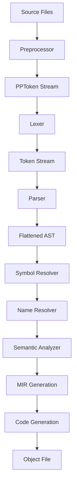

# Cendol - C11 Compiler Design Document

## Table of Contents
1. [Overview](#overview)
2. [Architecture Overview](#architecture-overview)
   2.1. [Compiler Driver Design](compiler_driver_design.md)
   2.2. [Rust Environment and External Crates](rust_environment_design.md)
3. [Preprocessor Phase](preprocessor_design.md)
4. [Lexer Phase](lexer_design.md)
5. [Parser Phase](parser_design.md)
6. [Abstract Syntax Tree (AST) Design](ast_design.md)
7. [Semantic Analysis Phase](semantic_analysis_design.md)
8. [MIR Generation](mir_design.md)
9. [Code Generation](codegen_design.md)
10. [AST Dumper Phase](ast_dumper_design.md)
11. [Data Flow and Integration](data_flow_design.md)
12. [Performance Considerations](performance_design.md)
13. [Error Handling Strategy](error_handling_design.md)

## Overview

This document outlines the design for Cendol, a high-performance C11 compiler written in Rust. The compiler follows a modern multi-phase architecture optimized for performance, cache efficiency, and comprehensive C11 standard compliance. The design features a flattened AST representation, a dedicated MIR (Middle Intermediate Representation) for semantic analysis and optimization, and Cranelift-based code generation.

### Design Goals
- **Performance**: Minimize memory allocations and maximize cache locality
- **Standards Compliance**: Full C11 support including all optional features
- **Modularity**: Clear separation of concerns between phases
- **Extensibility**: Easy to extend for future C standards and optimizations
- **Debuggability**: Comprehensive error reporting and debugging support

## Architecture Overview

### Key Design Decisions

1. **Flattened AST Storage**: All AST nodes in contiguous vectors for superior cache performance
2. **Global Symbol Interning**: Thread-safe symbol interning using `symbol_table` crate
3. **Packed Source Locations**: Efficient `SourceLoc` (4 bytes) and `SourceSpan` (8 bytes)
4. **Index-based References**: `NodeRef`, `TypeRef`, `SymbolRef` for fast access
5. **Bit Flags**: Compact boolean storage using `bitflags` crate for flags
6. **Rich Diagnostics**: IDE-quality error reporting with `annotate_snippets`
7. **MIR-based Design**: Dedicated Mid-level Intermediate Representation for semantic analysis and optimization
8. **Cranelift Integration**: Efficient code generation through Cranelift backend

## Compiler Pipeline Phases

### 1. Preprocessor Phase
Transforms C source code by handling macro expansion, conditional compilation, and file inclusion. Produces a stream of preprocessing tokens (`PPToken`) that represent the preprocessed source.

**Key Features:**
- Modular architecture with separate lexer (`pp_lexer.rs`), expression parser (`expr_parser.rs`), and main preprocessor (`preprocessor.rs`)
- Full macro expansion with argument rescanning, token pasting, and stringification
- Include file resolution with header guard detection and system include paths
- Conditional compilation with `#if`, `#ifdef`, `#ifndef`, `#elif`, `#else`, `#endif`
- Built-in macro expansion for `__FILE__`, `__LINE__`, `__DATE__`, `__TIME__`
- Packed bit flags for token properties using `bitflags` crate

### 2. Lexer Phase
Tokenizes the preprocessing token stream into lexical tokens with pre-interned keywords. Converts `PPToken` stream to `Token` stream ready for parsing.

**Key Features:**
- UTF-8 only support with efficient character handling
- Global symbol interning for identifiers using `symbol_table` crate
- Pre-interned keyword table for O(1) keyword recognition
- Integer and float literal parsing with C11 syntax support
- String literal concatenation (C11 6.4.5)
- Packed token flags for lexical properties

### 3. Parser Phase
Constructs a flattened Abstract Syntax Tree from the token stream using Pratt parsing for expressions and recursive descent for statements.

**Key Features:**
- Flattened AST storage in contiguous vectors for cache efficiency
- Pratt parser with full C11 operator precedence and associativity
- Index-based node references (`NodeRef`, `TypeRef`) for fast access
- Complex declarator parsing for C's type system (pointers, arrays, functions)
- Comprehensive error recovery with synchronization points
- Support for all C11 syntax including generics, atomics, and compound literals

### 4. Symbol Resolver Phase
Performs initial symbol collection and resolution, transforming parser-specific nodes to semantic nodes with resolved types.

**Key Features:**
- Symbol collection and scope establishment
- Transformation of parser-only nodes to semantic nodes
- Initial type resolution for basic types
- Preparation of AST for full semantic analysis
- Generation of scope mapping for each AST node

### 5. Name Resolution Phase
Resolves identifier names to their corresponding symbol table entries, handling C's complex scoping rules.

**Key Features:**
- Identifier-to-symbol mapping
- Proper handling of C's scoping rules (block scope, function scope, etc.)
- Resolution of function, variable, and type names
- Handling of forward declarations and definitions
- Validation of name uniqueness within scopes

### 6. Semantic Analysis Phase
Performs comprehensive type checking and semantic validation of the AST.

**Key Features:**
- Type checking and compatibility validation
- Expression type resolution
- Implicit conversion analysis
- LValue/RValue categorization
- Semantic validation of all C constructs
- Generation of semantic information side table

### 7. MIR Generation Phase
Transforms the annotated AST into a typed, explicit Mid-level Intermediate Representation suitable for optimization and code generation.

**Key Features:**
- Typed MIR with explicit control flow
- Non-SSA basic block structure
- Explicit memory operations and type conversions
- Cranelift-friendly representation
- Comprehensive type information preserved
- Validation of MIR correctness before code generation

### 8. Code Generation Phase
Generates target code using the Cranelift backend, producing optimized object files.

**Key Features:**
- Cranelift-based code generation
- Target-specific optimization
- Object file generation
- Linker integration for executable creation
- Support for multiple target architectures

## Supporting Infrastructure

### Error Handling
- Rich diagnostic system with `annotate_snippets` for beautiful error messages
- Phase-specific error recovery strategies with synchronization points
- IDE integration with structured error output
- Non-blocking compilation that continues despite errors
- Detailed source location tracking with `SourceSpan`

### Data Flow
- Clear interfaces between all compiler phases using dedicated data structures
- Efficient memory management with arena-style allocation patterns
- Global symbol interning for fast identifier comparison across phases
- Packed data structures for optimal cache usage and memory efficiency
- Semantic information side tables for post-analysis data

### Performance Optimizations
- Flattened data structures for cache-friendly access patterns
- Index-based references instead of pointers to reduce indirection
- Bit flags for compact boolean storage using `bitflags` crate
- Streaming processing to minimize memory pressure
- Pre-interned symbols and keywords for fast lookups
- MIR validation to catch errors early in the pipeline