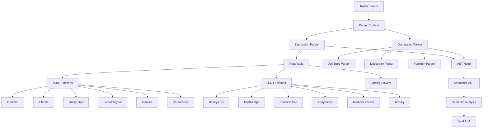
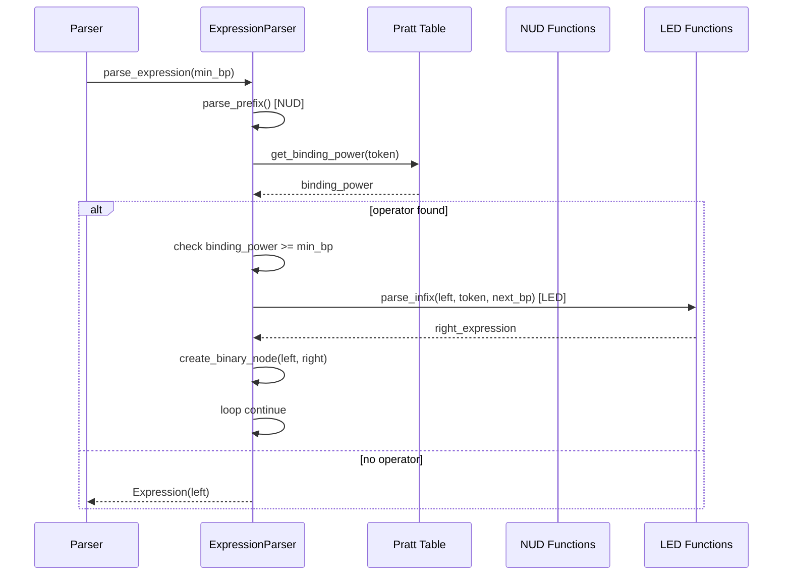

# Additional Pratt Parser Architecture Diagram



## Pratt Parser Flow



## C11 Operator Precedence (Pratt Style)

```mermaid
graph LR
    A[Primary] --> B[Postfix]
    B --> C[Unary]
    C --> D[Cast]
    D --> E[Multiplicative]
    E --> F[Additive]
    F --> G[Shift]
    G --> H[Relational]
    H --> I[Equality]
    I --> J[Bitwise AND]
    J --> K[Bitwise XOR]
    K --> L[Bitwise OR]
    L --> M[Logical AND]
    M --> N[Logical OR]
    N --> O[Ternary]
    O --> P[Assignment]
    P --> Q[Comma]