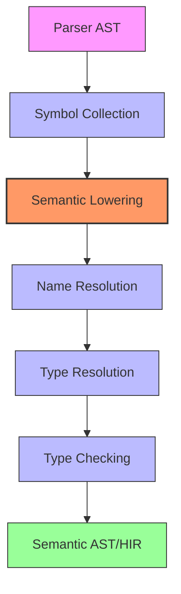
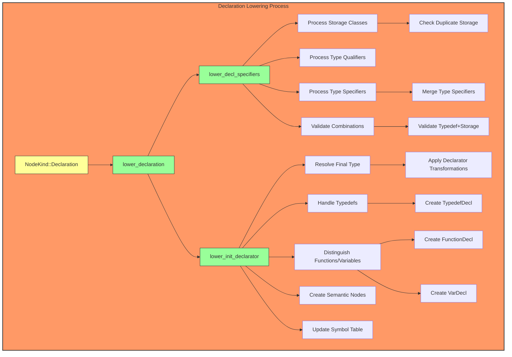
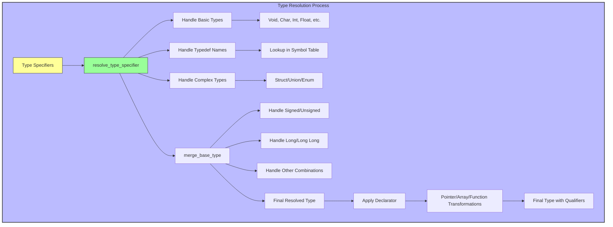
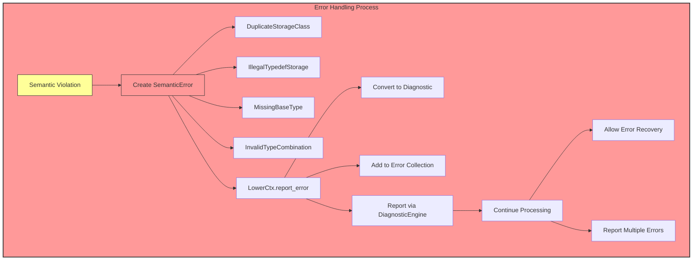
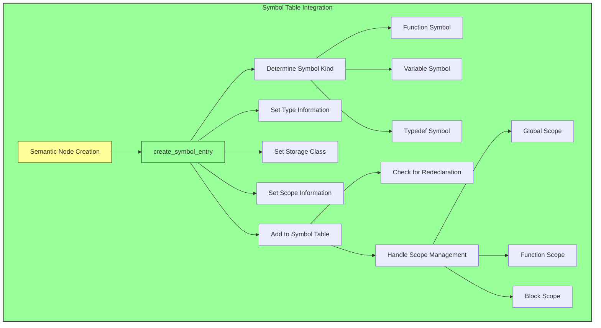
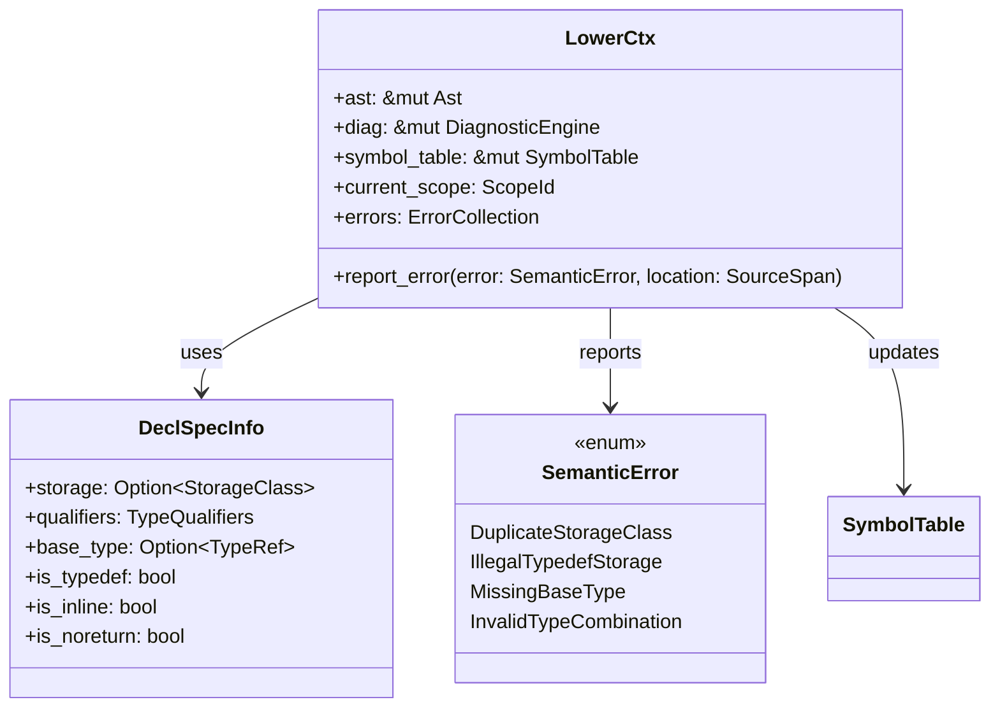

# Semantic Lowering Process Flow

## Overview Diagram

## Detailed Lowering Process

## Type Resolution Flow

## Error Handling Flow

## Symbol Table Integration

## Key Data Structures

## Process Summary

1. **Input**: Parser AST with `NodeKind::Declaration` nodes
2. **Processing**: Transform declarations into semantic nodes with resolved types
3. **Output**: Semantic AST with `VarDecl`, `FunctionDecl`, `TypedefDecl` nodes
4. **Side Effects**: Updated symbol table with type information
5. **Error Handling**: Comprehensive error reporting with recovery

The semantic lowering phase bridges the gap between the grammar-oriented parser AST and the type-resolved semantic AST, enabling robust type checking and code generation.