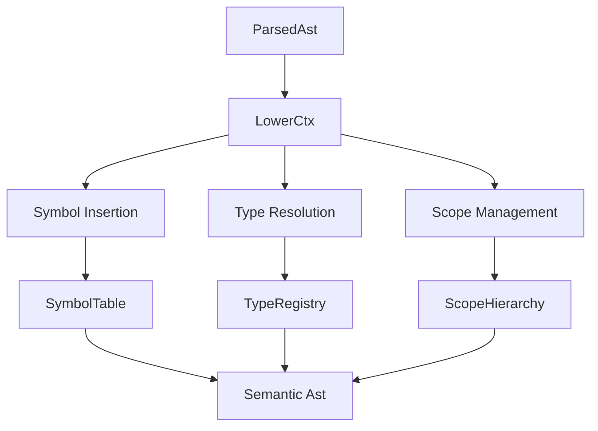
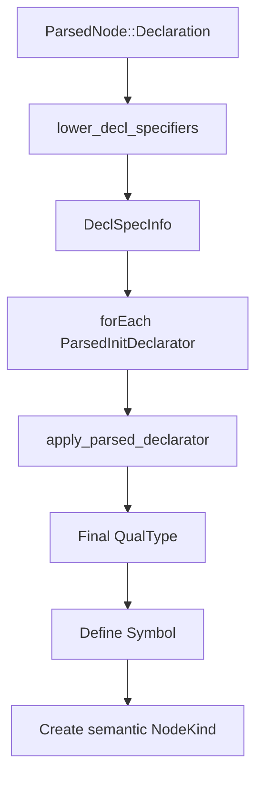
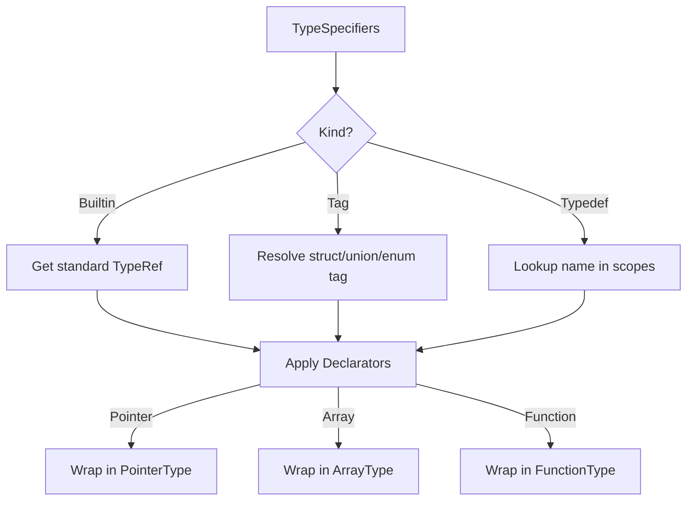

# Semantic Lowering Process Flow

## Overview Diagram

The lowering phase acts as the bridge between the purely syntactic `ParsedAst` and the semantically meaningful `Ast`.

```mermaid
flowchart TD
    A[ParsedAst] --> B[LowerCtx]
    B --> C[Symbol Insertion]
    B --> D[Type Resolution]
    B --> E[Scope Management]
    C --> F[SymbolTable]
    D --> G[TypeRegistry]
    E --> H[ScopeHierarchy]
    F & G & H --> I[Semantic Ast]
```

## Detailed Lowering Process

### 1. Declaration Processing
When the lowerer encounters a declaration, it follows this sequence:

```mermaid
flowchart TD
    A[ParsedNode::Declaration] --> B[lower_decl_specifiers]
    B --> C[DeclSpecInfo]
    C --> D[forEach ParsedInitDeclarator]
    D --> E[apply_parsed_declarator]
    E --> F[Final QualType]
    F --> G[Define Symbol]
    G --> H[Create semantic NodeKind]
```

### 2. Type Resolution Flow
Syntactic types are resolved to canonical forms:

```mermaid
flowchart TD
    A[TypeSpecifiers] --> B{Kind?}
    B -- Builtin --> C[Get standard TypeRef]
    B -- Tag --> D[Resolve struct/union/enum tag]
    B -- Typedef --> E[Lookup name in scopes]
    C & D & E --> F[Apply Declarators]
    F -- Pointer --> G[Wrap in PointerType]
    F -- Array --> H[Wrap in ArrayType]
    F -- Function --> I[Wrap in FunctionType]
```

## Hierarchical Scopes

Scopes are managed strictly according to C rules:

- **File Scope**: Top-level declarations.
- **Function Scope**: Parameters and labels.
- **Block Scope**: Internal variables (handles shadowing).
- **Prototype Scope**: Temporary scope for function parameters in declarations.

## Error Recovery

If lowering fails for a specific declaration (e.g., duplicate name), it:
1. Reports a `SemanticError`.
2. Attempts to create a "dummy" or "incomplete" symbol to allow parsing of the rest of the file.
3. Marks the compilation session as failed to prevent codegen.